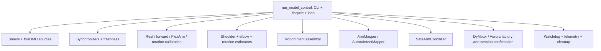
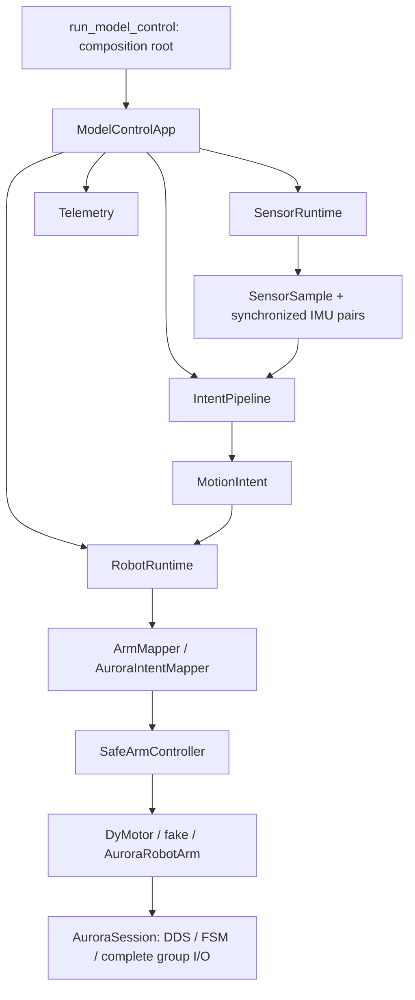

# Model control architecture

## Audit before refactoring

Baseline: working tree at `3c152f4552fbaaa723bae516e41a1ba573b0e150`,
including all pre-existing user edits. `tools/run_model_control.py`: 741 lines.
No `.codegraph/` index was present. No robot was connected during this work.

| Responsibility in the old entry point | Destination |
| --- | --- |
| CLI/config loading and composition | Entry point + runtime configuration |
| Sleeve creation, IMU sources, start/latest/close | `runtime/sensors.py` |
| Pair synchronization, pair freshness | `runtime/sensors.py` |
| Rest/forward calibration, FlexArm calibration/reuse | `runtime/intent_pipeline.py` |
| Shoulder, elbow, upper-arm rotation, MotionIntent assembly | `runtime/intent_pipeline.py` |
| Backend creation/connection, mapping, enable, submit/preview, feedback | `runtime/robot_runtime.py` |
| State, readiness, watchdog, error counts, duration, Ctrl+C, cleanup | `runtime/model_control.py` |
| Status and IMU debug formatting | `runtime/telemetry.py` |
| SDK/DDS, FSM preparation and streaming checks | Aurora robot layer |

All rows except CLI/config/composition belong outside the entry point.
The old entry point also mutated `robot.session.operator_confirmed`, selected
Aurora policies inside the loop, and delegated offline preview to another CLI.

## Implemented boundaries

The entry point is now **41 lines** (741 before), with no backend selection,
calibration, control loop, direct SDK/session access or telemetry formatting.
Argument definitions/config validation live in `runtime/configuration.py`;
`main()` calls its parser/loader and composes the four runtimes and telemetry.

Data flow: Sensor → Intent → Mapping inside RobotRuntime → Backend.
IMU and Aurora have no dependency on each other. `MotionIntent` is the sole
sensor/intent-to-robot data boundary; raw sensor values never reach the robot.
Telemetry observes data and does not control the loop.

Estimator source is now included in `sleeve_arm/estimation/flexarm/`; see
[local estimator migration](local_estimators.md) for provenance, dependencies
and compatibility with the former wheel. Predictor and estimation mathematics
stay outside the runtime modules. Preserve
rest then forward shoulder calibration, then rotation calibration; independent
shoulder/rotation synchronization thresholds; elbow/rotation EMA, twist axis,
and separate ordinary and rotation prediction error counters.

The proven DyMotor connection-before-serial/model startup order is retained.
Constructing runtimes must not connect hardware. The application owns cleanup;
one shutdown failure must not prevent the remaining resources from closing.

Two lifecycle holes were fixed: missing sleeve frames now age the last sample
and eventually hard-timeout; readiness cannot succeed with a partial intent
after rotation prediction failed. The existing sensor/hard timeout values,
prediction error thresholds and separate rotation error counts are unchanged.
DyMotor holds on transient prediction/rotation failures; Aurora faults on the
first prediction error or stale sample. A slow inference cannot submit after
hard timeout. Operator confirmation is followed by new robot feedback so an
old pre-confirmation pose is never used as a startup command.

`FakeImuSource` defaults to identity quaternions, which cannot pass the real
forward calibration (minimum 15° raise). SensorRuntime now supplies a synthetic
45° forward arm quaternion during that stage only, then returns to rest. This
fix is restricted to `--imus fake`; it does not change estimator mathematics,
calibration ordering, real frames, thresholds, axes, models or model weights.

## Compatibility and verification

All existing CLI flags remain, including fake/dymotor/aurora/aurora-fake,
dual_imu/flexarm_estimator, calibration/reuse/output, duration, debug, config,
library/diagnostics, `--side`/`--arm-side` and `--source-side`.
`--confirm EXECUTE_AURORA` remains deprecated and does not bypass interactive
confirmation. The only new flag is `--prepare-aurora-fsm` (explicit execute and
confirmation required). Real Aurora without execute is still fully offline;
it opens neither DDS nor sensors and does not require model artifacts.

Internal helper imports move from `tools.run_model_control` to
`sleeve_arm.runtime.sensors` or `sleeve_arm.runtime.intent_pipeline`; repository
callers were migrated. No CLI flags were removed. Existing `AuroraRobotArm`,
`AuroraSession` and factory imports remain compatible; no facade or duplicate
driver hierarchy was introduced.

Regression coverage:

- `tests/fixtures/model_control_golden.json`: captured original working-tree
  prediction code, 12 sample steps across both shoulder backends; exact intent
  metadata and floating-point-equivalent semantic targets for both mappers.
- `test_model_intent_regression.py`: golden values, calibration order/reuse,
  independent sync thresholds, stale pairs, EMA/twist results, source cleanup,
  full fake CLI using the real dual-IMU estimator.
- `test_model_control_app.py`: fake runtimes/clock, new samples, hold/fault,
  independent error counts, readiness, slow inference, duration, Ctrl+C,
  robot errors, confirmation cancellation and independent cleanup.
- `test_robot_runtime.py`: mapper selection, apply/preview, and operator/FSM
  preparation, with only injected fake robot connections.
- `test_aurora_streaming.py`: GR3 left/right routing, indices 0/3, all 7 slots,
  preserved joints, only selected groups, invalid FSM/stability, preparation
  confirmation/wait/timeout, DDS environment, exact optional publisher matching.

The existing IMU demo test fixture used to exhaust 80 frames at about 80 ms
while requesting a 100 ms calibration, causing an intermittent missing CSV.
Only that fake serial fixture was corrected to disconnect after the first
actual CSV write; production demo/IMU code and assertions were preserved.

Acceptance on 2026-09-26: baseline **361 passed**; final
`python -m pytest -q -p no:cacheprovider`: **453 passed in 19.96 s**.
Cacheprovider was disabled to avoid an existing workspace cache-permission
warning, not to skip tests. Real `dual_imu` estimator calibration and short
control loops ran successfully with both fake robot backends; Aurora profile
preview returned NO MOTION without DDS or sensor connections.
The migrated pair/freshness/collection/FlexArm helpers retain identical ASTs;
dual-IMU preparation adds only the synthetic calibration-stage callback.
Existing predictor, estimation, domain, configuration and source algorithm
files were not changed by this task. User edits outside the explicit refactor
and test/import migrations were checked against the starting diff unchanged.

Before hardware use, verify site sign/zero (especially shoulder yaw), configured
limits/step/velocity/tracking tolerances, actual SDK/server/endpoint matching,
PdStand stability and pose-feedback timing, single-group authority, and fault
behavior under packet loss. `set_group_cmd` returning None does not acknowledge
delivery or physical completion. Shutdown stops publishing; it is not a
hardware emergency stop and sends no restoring pose/FSM change.

## Aurora control decision

Streaming uses `get_group_state` + `set_group_cmd`. Every publication carries
the complete selected group, seeded from valid feedback, preserving uncontrolled
slots. Application safety limits each step and velocity. Never create a
MoveCommandManager or wait for trajectory completion inside the sensor loop.

Discrete motion uses `MoveCommandManager` + `set_move_command` and optional
`wait_groups_motion_complete`; the official example uses whole-body FSM 3 and
upper-body FSM 4. Its planning/completion behavior would block or repeatedly
restart trajectories in continuous sensor following.

Standing streaming uses PdStand (FSM 2), with `get_stand_pose()[3] > 100`.
No default FSM change. An explicit preparation option requires interactive
operator confirmation, sends FSM 2 only, and waits for FSM and stability.
FSM 10/11 are not standing defaults: Upper UserCmd places lower limbs in zero
torque. All FSM logic remains in the robot layer.

## Ground truth

Read on 2026-09-26:

- [Fourier developer guide](https://support-old.fftai.com/docs/GR-X-Humanoid-Robot/GR3/SDK/Aurora-SDK/developer_guide/)
- [Client API](https://support-old.fftai.com/docs/GR-X-Humanoid-Robot/GR3/SDK/Aurora-SDK/reference/API_document/)
- [Move Command example](https://support-old.fftai.com/docs/GR-X-Humanoid-Robot/GR3/SDK/Aurora-SDK/examples/move_command_example/)
- [PdStand](https://support-old.fftai.com/docs/GR-X-Humanoid-Robot/GR3/SDK/Aurora-SDK/reference/controller_reference/pd_stand_state/)
- [UserCmd](https://support-old.fftai.com/docs/GR-X-Humanoid-Robot/GR3/SDK/Aurora-SDK/reference/controller_reference/user_cmd_state/)
- [Upper UserCmd](https://support-old.fftai.com/docs/GR-X-Humanoid-Robot/GR3/SDK/Aurora-SDK/reference/controller_reference/upper_user_cmd_state/)
- [RL Locomotion](https://support-old.fftai.com/docs/GR-X-Humanoid-Robot/GR3/SDK/Aurora-SDK/reference/controller_reference/rl_locomotion_state/)
- [DDS reference](https://support-old.fftai.com/docs/GR-X-Humanoid-Robot/GR3/SDK/Aurora-SDK/reference/aurora_dds_reference_CN/): robot_control_group_cmd, whole_body_fsm_state_change_cmd, upper_body_fsm_state_change_cmd
- [Validated backend](https://github.com/Kaiwei-Lin/electronic_skin_project/blob/master/electronic_skin/robot/backends/aurora.py)
- [Reference demo](https://github.com/Kaiwei-Lin/electronic_skin_project/blob/master/docs/reference/aurora_reference_demo.py), [configuration](https://github.com/Kaiwei-Lin/electronic_skin_project/blob/master/docs/reference/gr3_aurora_hand_demo.yaml), [hand bridge](https://github.com/Kaiwei-Lin/electronic_skin_project/tree/master/robot/aurora_hand_bridge)
